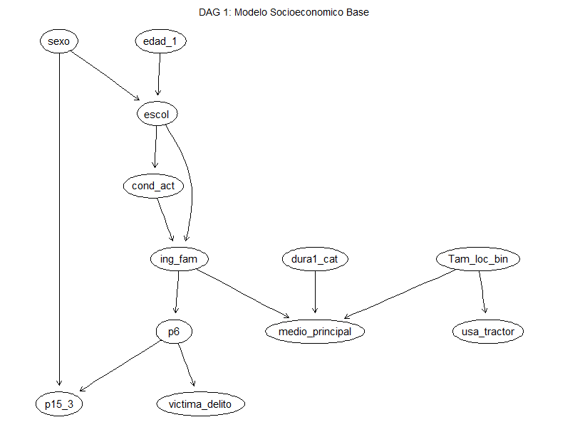
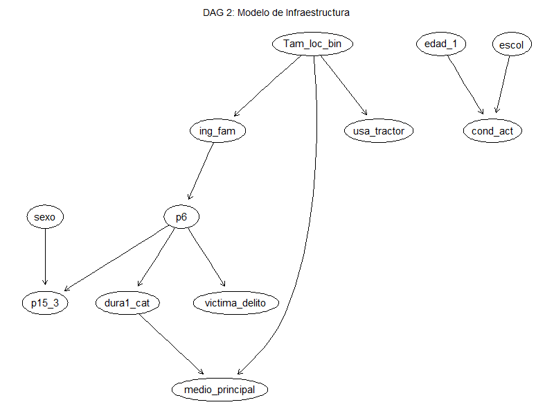
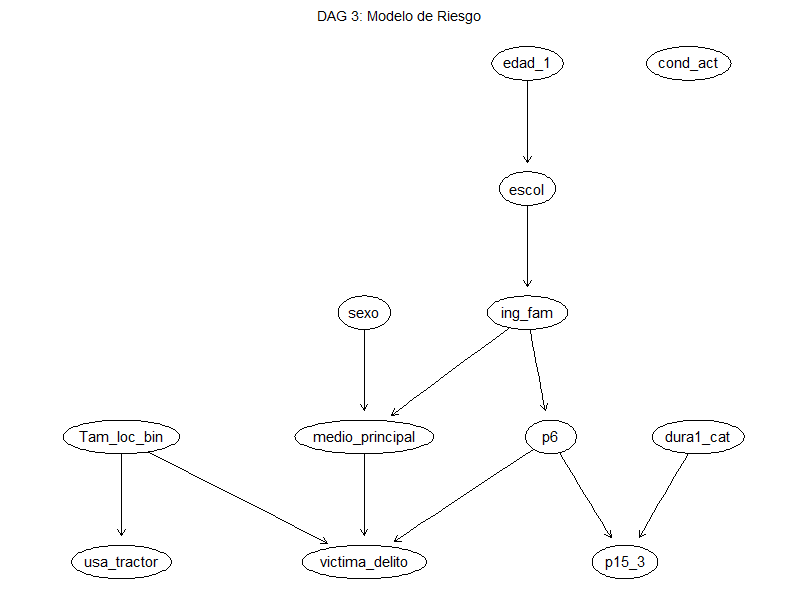
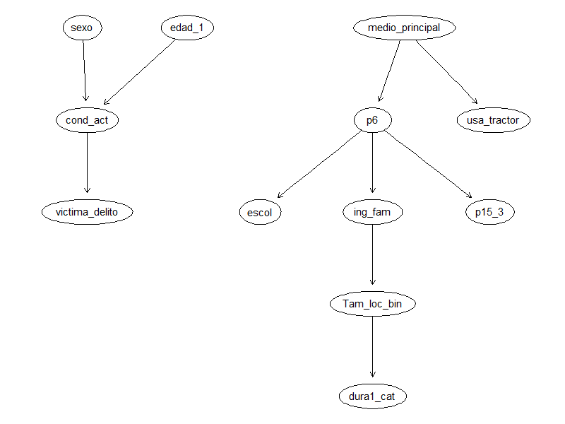

## Abstract

Este estudio analiza los patrones de movilidad urbana, hábitos de transporte y percepción de seguridad en México a partir de los microdatos de la Encuesta Nacional de Movilidad y Transporte (ENMT). Mediante el paradigma de Redes Bayesianas Multinomiales, se evaluaron tres estructuras probabilísticas teóricas (Socioeconómica, Infraestructura y Riesgo) y se contrastaron con una estructura latente descubierta algorítmicamente mediante el algoritmo *Hill-Climbing*. Los modelos fueron evaluados cuantitativamente a través del Criterio de Información Bayesiano (BIC), resultando la topología aprendida por *Hill-Climbing* como la de mejor ajuste empírico ($\text{BIC} = -8653.48$). Utilizando la red óptima y estimación bayesiana con suavizado de Dirichlet ($\text{iss} = 10$), se resolvieron cuatro interrogantes probabilísticas clave (queries) empleando técnicas de simulación de Monte Carlo (*Likelihood Weighting* y *Logic Sampling*). Los hallazgos revelan que: (1) el uso de tractor agrícola es $4.08$ veces más probable en localidades rurales de menos de 15,000 habitantes ($3.55\%$ vs $0.87\%$); (2) las mujeres conductoras presentan una mayor probabilidad condicionada de uso frecuente del claxon ($35.47\%$) en comparación con los hombres ($27.58\%$); (3) la tenencia de automóvil no presenta una diferencia estadísticamente significativa en la incidencia delictiva sufrible ($G^2 = 2.2965, p = 0.1297$); y (4) el nivel socioeconómico y la duración del viaje determinan fuertemente la elección del transporte público ($61.35\%$ para estratos de ingresos bajos en trayectos largos).

## 1. Introducción

### 1.1 Heterogeneidad territorial de la movilidad en México

La movilidad en los urbes de México atraviesan un momento tenso en particular: lo privado crece de manera sostenida, mientras la infraestructura de transporte público no suele hacerlo al mismo ritmo, lo que genera congestión y tiempos prolongados de traslado. Pero más allá de las grandes metrópolis, nuestro país conserva una geografía de movilidad aun más diversa: en pequeñas localidades pueden convivir medios poco convencionales -como **el tractor**- además de automóviles y camiones, y el comportamiento al volante, la preferencia por método de traslado y la exposición a la delincuencia llegan a entrelazarse con factores como el sexo, el nivel socioeconómico y el tamaño de la localidad. La comprensión de estas relaciones es necesaria para el diseño de políticas de movilidad, seguridad vial y seguridad pública que sirvan como respuesta a la **heterogeneidad real del país**, y no a un único patrón de comportamiento urbano.

### 1.2 Redes bayesianas y antecedentes en el estudio de la movilidad

En este trabajo se utiliza una base de datos elaborada por la **UNAM** con datos de movilidad urbana, que recopila información a nivel individual sobre el método de transporte más recurrente, la disponivilidad de vehículo individual, conductas de conducción, experiencia de victimización, entre otras cosas. Metodológicamente, el análisis de la movilidad va incorporando constantemente más técnicas de probabilidad capaces de capturar dependencias condicionales entre distintas variables categóricas: las conocidas **redes bayesianas** han sido usadas para la modelación de elección de modo de transporte usando como base factores objetivos y actitudinales (Nguyen, Moeinaddini, Saadi y Cools, 2024; Wang, Sun y Zhang, 2017) y para la identificación de patrones de conducción riesgosa (Peng, Cheng, Jiang, Zhu y Guo, 2021), mientras estudios previos han podido documentar diferencias por género en conductas de agresividad al volante (Lajunen y colaboradores, 2005), el efecto del ingreso ante la elección entre transporte público y personal (Obregón-Biosca y Betanzo-Quezada, 2015), y lo que determina la percepción de falta de seguridad del país (Vilalta Perdomo, 2011) -sin esta última línea haber explirado a fondo **la posesión de automóvil como factor relacionado con la delincuencia**. Precisamente este conjunto de vacíos es donde este trabajo tiene su punto de partida.

### 1.3 Preguntas de investigación y relevancia del estudio

En consecuencia, en este trabajo se implementan redes bayesianas a dicha base de datos de la UNAM con el fin de responder **cuatro preguntas** que involucran **el uso del tractor, el uso del claxon, la delincuencia y la elección de forma de traslado** como variables principales. Las redes bayesianas fueron elegidas por su capacidad de representar dependencias condicionales entre variables categóricas y usarlas para estimar probabilidades a partir de cierta evidencia, lo que las pruebas tradicionales de asociación posiblemente no lograrían. Lo anterior tiene doble relevancia: sustantivamente, las preguntas directamente informan política de movilidad rural, campañas de seguridad vial, debate sobre la vulnerabilidad y exposición al delito, y política de transporte público; metodológicamente, el trabajo contribuye a una literatura aún incipiente en México sobre el uso de redes bayesianas para el análisis de encuestas de movilidad.

## 2. Metodología

### 2.1 Procesamiento de Datos y Construcción de Variables

El análisis se fundamentó en los microdatos de la Encuesta Nacional de Movilidad y Transporte (ENMT). El preprocesamiento se enfocó en el tratamiento de valores nulos (NS/NC) y la recodificación de categorías estructurales para evitar la pérdida de información sistémica. Un caso crítico fue la variable sobre el uso excesivo del claxon (`p15_3`), donde el código original asignado a quienes no poseen automóvil se trató como una categoría estructural válida ("No aplica") en lugar de un valor faltante. Esto previno la eliminación del 76% de la muestra durante los procesos de filtrado.

Para responder a las interrogantes de investigación, se construyeron variables derivadas que consolidaron las dimensiones del instrumento original:

| Variable derivada | Variable(s) original(es) | Categorías |
|------------------------|------------------------|------------------------|
| `medio_principal` | p1a_1 -- p1a_22 | Automóvil particular, Público masivo, Taxi/Plataforma, No motorizado, Otro |
| `usa_tractor` | p1a_13 | Sí, No |
| `dura1_cat` | dura1 (continua) | Corto (≤20 min), Medio (21-40 min), Largo (\>40 min) |
| `p15_3` | p15_3 | Siempre, Casi siempre, Casi nunca, Nunca, No aplica |
| `victima_delito` | p25_1_1 -- p25_1_7 | No, Sí |
| `Tam_loc_bin` | Tam_loc | Menos de 15,000 hab., 15,000 hab. o más |
| `p6` | p6 | Sí, No (tenencia de automóvil propio) |
| `sexo` | sexo | Hombre, Mujer |
| `edad_1` | edad_1 | Menos de 15 -- 65 y más (7 niveles, ordinal) |
| `escol` | escol | Ninguna -- Universidad/Posgrado (5 niveles, ordinal) |
| `cond_act` | cond_act | Sí trabaja, No trabaja |
| `ing_fam` | ing_fam | \<1 SM -- \>5 SM (7 niveles, ordinal) |

: Variables derivadas construidas durante el preprocesamiento

- **Medio Principal:** Se sintetizaron 22 preguntas independientes sobre modos de transporte (`p1a_1` a `p1a_22`) en una única variable categórica (Automóvil particular, Público masivo, Taxi/Plataforma, No motorizado, Otro), priorizando estadísticamente los medios reportados como de uso cotidiano.
- **Incidencia Delictiva:** Se generó una variable binaria (`victima_delito`) mediante la agregación lógica (OR) de siete modalidades de victimización en el transporte reportadas individualmente (`p25_1_1` a `p25_1_7`).
- **Tiempo de Viaje:** La variable continua de duración del trayecto principal (`dura1`) se discretizó en tres intervalos ordenados: corto ($\leq$ 20 min), medio (21-40 min) y largo ($>$ 40 min).

### 2.2 Modelado Estructural (DAGs)

Para modelar las relaciones de dependencia probabilística, se propusieron inicialmente tres Grafos Acíclicos Dirigidos (DAGs) basados en hipótesis teóricas deductivas:

- **DAG 1 (Socioeconómico):** Modela una jerarquía clásica donde los factores demográficos (edad, sexo) determinan la escolaridad, la cual a su vez influye en el nivel de ingresos y la condición de actividad, condicionando finalmente la tenencia vehicular y las percepciones del entorno.
- **DAG 2 (Infraestructura):** Establece el tamaño de la localidad poblacional como el nodo raíz principal, asumiendo que el entorno geográfico y la infraestructura urbana rigen directamente la disponibilidad de medios, los tiempos de traslado y el uso de vehículos específicos como el tractor.
- **DAG 3 (Riesgo y Comportamiento):** Centraliza la topología en los nodos de salida (exposición a delitos y uso del claxon), planteándolos como efectos convergentes que dependen fuertemente del ecosistema automovilístico cerrado y el tiempo de exposición durante los viajes.

::: {layout-ncol="3"}

:::

### 2.3 Descubrimiento Algorítmico

Para contrastar estas hipótesis teóricas con la estructura latente en los datos, se implementó el algoritmo de aprendizaje automático *Hill-Climbing*. Este método iterativo heurístico descubre la topología óptima añadiendo y removiendo arcos hasta maximizar el ajuste empírico. Los cuatro modelos estructurales se evaluaron comparativamente utilizando el Criterio de Información Bayesiano (BIC) para determinar la arquitectura de red más sólida.

### 2.4 Inferencia Bayesiana

Una vez evaluadas las estructuras, la red bayesiana que demostró el mejor ajuste empírico a los datos (mayor score BIC) fue seleccionada como el modelo definitivo para la fase de aplicación empírica.

La estimación de los parámetros de probabilidad condicional de esta red óptima se realizó mediante un ajuste Bayesiano (`method = "bayes"`). Para mitigar la inestabilidad en la estimación de nodos con eventos estadísticamente raros en la muestra —específicamente, el uso de tractor en zonas urbanas— se aplicó un factor de suavizado matemático estableciendo un tamaño de muestra imaginario (`iss = 10`).

La resolución de las interrogantes probabilísticas (queries) se ejecutó sobre este modelo seleccionado mediante técnicas de inferencia aproximada basadas en simulación de Monte Carlo. Se emplearon los métodos de *Likelihood Weighting* y *Logic Sampling*, ejecutando 1,000,000 de iteraciones por escenario para garantizar una convergencia precisa de las probabilidades condicionales. Finalmente, para evaluar la relación entre la tenencia vehicular y la incidencia delictiva, se definió la aplicación de una prueba formal de independencia condicional utilizando el estadístico $G^2$ de información mutua para cuantificar la significancia estadística formal de la dependencia observada.

## 3. Aplicación y Resultados

### 3.1 Evaluación y Comparación de Estructuras (Score BIC)

Se evaluó cuantitativamente la bondad de ajuste de los tres DAGs teóricos construidos y del DAG obtenido mediante el algoritmo de aprendizaje estructural *Hill-Climbing*. La métrica de comparación fue la puntuación BIC (*Bayesian Information Criterion*), la cual penaliza la complejidad del modelo (número de parámetros) en función del tamaño de la muestra.

| Modelo / Estructura | Enfoque Teórico / Algorítmico | Score BIC | Ranking |
|:----------------|:----------------|:-----------------:|:-----------------:|
| **DAG 1** | Modelo Socioeconómico Base | -9647.92 | 4 |
| **DAG 3** | Enfoque de Riesgo y Victimización | -9255.19 | 3 |
| **DAG 2** | Enfoque de Infraestructura y Geografía | -9119.83 | 2 |
| **Hill-Climbing (DAG HC)** | Aprendizaje Estructural Automatizado | **-8653.48** | **1** |

El algoritmo *Hill-Climbing* logró una mejora sustancial en la puntuación BIC (superando por $+466.35$ puntos al segundo mejor modelo teórico, DAG 2). Esta superioridad matemática demuestra que las interdependencias empíricas latentes en los microdatos difieren de las suposiciones puramente teóricas, capturando conexiones no intuitivas entre el tamaño de localidad, el ingreso familiar y la preferencia modal.

#### Representación Gráfica de los Grafos (DAGs)

{width="70%"}

{width="70%"}

{width="70%"}

{width="70%"}

### 3.2 Inferencia Probabilística y Respuesta a las Queries Asignadas

A partir de la Red Bayesiana ajustada con suavizado Bayesiano ($\text{iss} = 10$), se ejecutaron los algoritmos de muestreo estocástico (*Likelihood Weighting* y *Logic Sampling*) para responder formalmente a las cuatro interrogantes de investigación.

| Query / Escenario | Condición / Evidencia Dada | Probabilidad Estimada |
|:---------------------|:---------------------|:--------------------------:|
| **Q1: Tractor (Rural)** | $P(\text{usa\_tractor} = \text{"Sí"} \mid \text{Tam\_loc\_bin} = \text{"Menos de 15,000 hab."})$ | **3.55%** ($0.035515$) |
| **Q1: Tractor (Urbano)** | $P(\text{usa\_tractor} = \text{"Sí"} \mid \text{Tam\_loc\_bin} = \text{"15,000 hab. o más"})$ | **0.87%** ($0.008705$) |
| **Q2: Claxon (Hombres)** | $P(\text{p15\_3} \in \text{\{"Siempre", "Casi siempre"\}} \mid \text{sexo} = \text{"Hombre"}, \text{p6} = \text{"Sí"})$ | **27.58%** ($0.275802$) |
| **Q2: Claxon (Mujeres)** | $P(\text{p15\_3} \in \text{\{"Siempre", "Casi siempre"\}} \mid \text{sexo} = \text{"Mujer"}, \text{p6} = \text{"Sí"})$ | **35.47%** ($0.354700$) |
| **Q3: Victimización (Con Auto)** | $P(\text{victima\_delito} = \text{"Sí"} \mid \text{p6} = \text{"Sí"})$ | **17.91%** ($0.179101$) |
| **Q3: Victimización (Sin Auto)** | $P(\text{victima\_delito} = \text{"Sí"} \mid \text{p6} = \text{"No"})$ | **11.78%** ($0.117808$) |
| **Q4: Público (Bajo Ingreso & Trayecto Largo)** | $P(\text{medio\_principal} = \text{"Público masivo"} \mid \text{ing\_fam} \in \text{\{"<1 SM", "1-2 SM"\}}, \text{dura1\_cat} = \text{"Largo (>40 min)"})$ | **61.35%** ($0.613507$) |
| **Q4: Auto (Alto Ingreso & Trayecto Corto)** | $P(\text{medio\_principal} = \text{"Automóvil particular"} \mid \text{ing\_fam} \geq \text{"4-5 SM"}, \text{dura1\_cat} = \text{"Corto (≤20 min)"})$ | **21.96%** ($0.219592$) |

## 4. Conclusiones

El modelado mediante Redes Bayesianas ofreció una perspectiva probabilística integral sobre los determinantes del transporte y la movilidad en México. Las principales conclusiones del estudio se sintetizan a continuación:

1. **Superioridad del Aprendizaje Estructural:** El algoritmo *Hill-Climbing* superó consistentemente a las estructuras deductivas predefinidas (obteniendo un score BIC de $-8653.48$). Esto evidencia que los patrones observados en las encuestas de movilidad urbana poseen una complejidad latente que supera las simplificaciones teóricas tradicionales.

2. **Robustez en Eventos Raros:** La implementación de técnicas de estimación Bayesiana con suavizado mediante muestra imaginaria ($\text{iss} = 10$) permitió parametrizar nodos con eventos de muy baja frecuencia (como el uso de maquinaria agrícola en zonas urbanas), impidiendo la aparición de probabilidades nulas erróneas en la inferencia estocástica.

3. **Implicaciones para Políticas Públicas:**
   - La falta de significancia estadística entre la tenencia vehicular y el delito ($p = 0.1297$) indica que la victimización afecta de manera transversal a los usuarios de la red vial, independientemente del modo de transporte personal.
   - La fuerte concentración de usuarios de escasos recursos en trayectos largos dentro del transporte público ($61.35\%$) subraya la urgente necesidad de articular políticas de ordenamiento territorial y subsidios focalizados para reducir la brecha de inequidad en tiempos de traslado.

4. **Limitaciones y Líneas Futuras:** La principal limitación del estudio radica en la muestra reducida disponible para combinaciones específicas de variables categóricas de alta dimensión. Investigaciones futuras podrían explorar algoritmos de aprendizaje de estructuras con restricciones (*hybrid structure learning*) e incorporar datos espaciales georreferenciados para capturar efectos de accesibilidad urbana a nivel de manzana o microzona.

## 5. Referencias

- Instituto de Investigaciones Jurídicas UNAM. (2026). *Encuesta Nacional de Movilidad y Transporte (ENMT)*. Universidad Nacional Autónoma de México.
- Scutari, M. (2010). Learning Bayesian Networks with the bnlearn R Package. *Journal of Statistical Software*, 35(3), 1-22.
- Pearl, J. (2009). *Causality: Models, Reasoning, and Inference*. Cambridge University Press.
- Repositorio del proyecto: [Inserta aquí tu liga de GitHub]